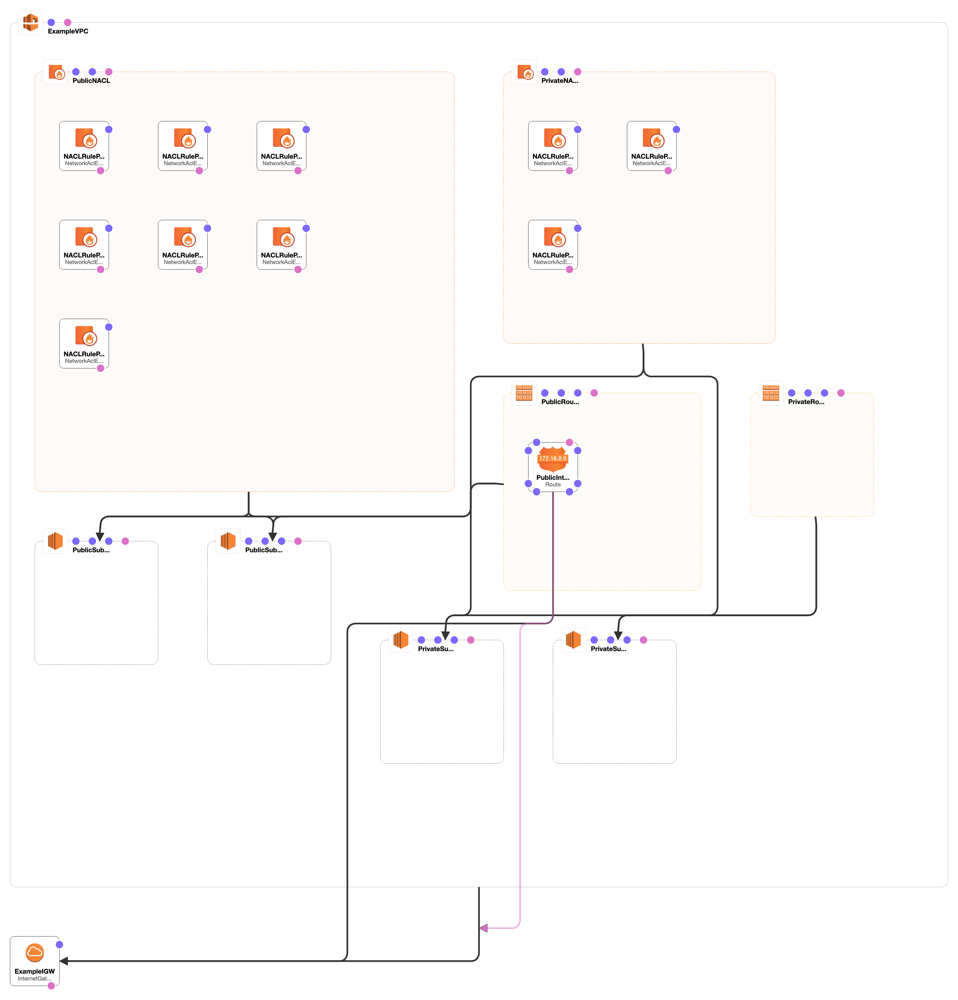

# Secure VPC in CloudFormation

## Stack

```bash
# validate template
$ make validate

# deploy with default parameters
$ make create-stack

# deploy with 'mine.json' parameters
$ PARAM_FILE=mine.json make create-stack

# describe stack events
$ make stack-events

# describe stack
$ make describe-stack

# delete stack
$ make delete-stack
```

## ChangeSet

```bash
# create change set
$ CHANGE_SET_NAME=Change1 make create-change

# describe change set
$ CHANGE_SET_NAME=Change1 make describe-change

# run change set
$ CHANGE_SET_NAME=Change1 make execute-change

# delete change set
$ CHANGE_SET_NAME=Change1 make delete-change
```


## Diagram


